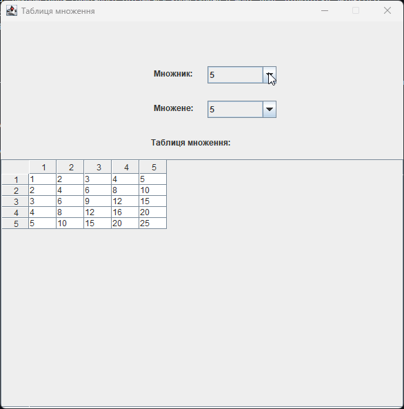

<h1 align="center">ЛАБОРАТОРНА РОБОТА №2</h1>
<h3 align="center">Тема: Використання графічного інтерфейсу користувача в мові Java. Бібліотека Swing</h3>
<h3 align="center">Виконав:	Желобецький Арсеній Павлович; група 6.1221</h3>
<h3 align="center">Варіант №5</h3>

## Завдання:

Таблиця множення для множників від 1 до n. (Примітка. Множники вказуються в заголовках рядків і стовпців. n вибирається за допомогою візуального компонента (віджета) на Ваш вибір. При зміні n таблиця автоматично змінюється).

<h3 align="center">Результат:</h3>

  

